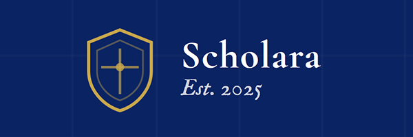
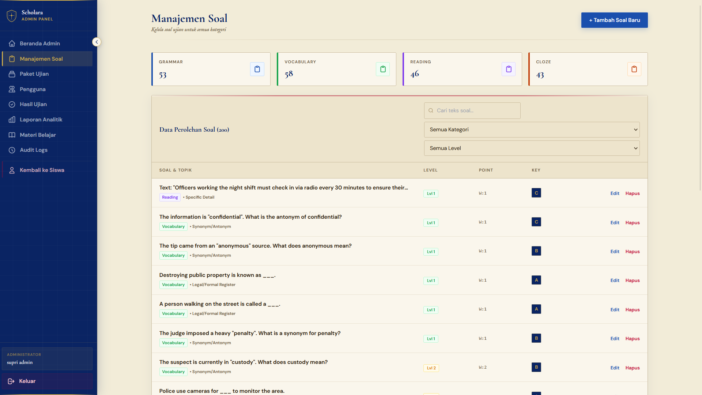
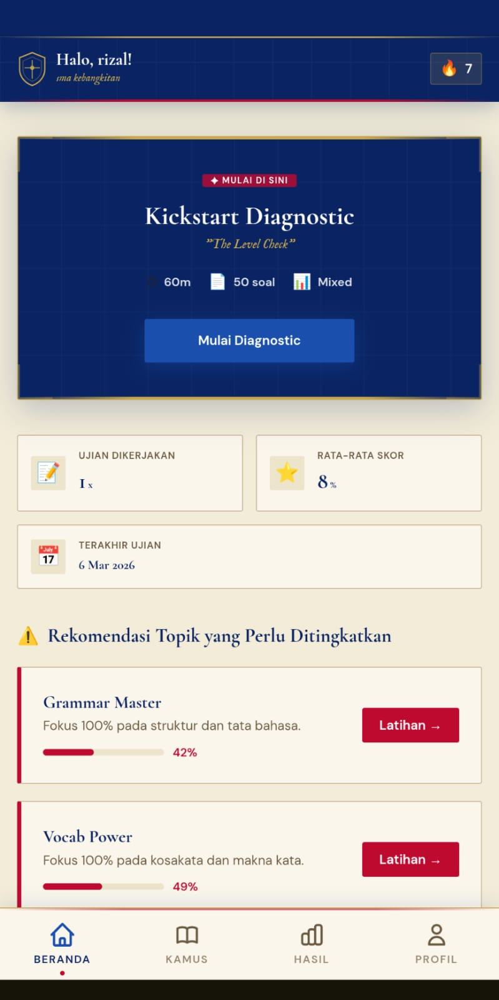
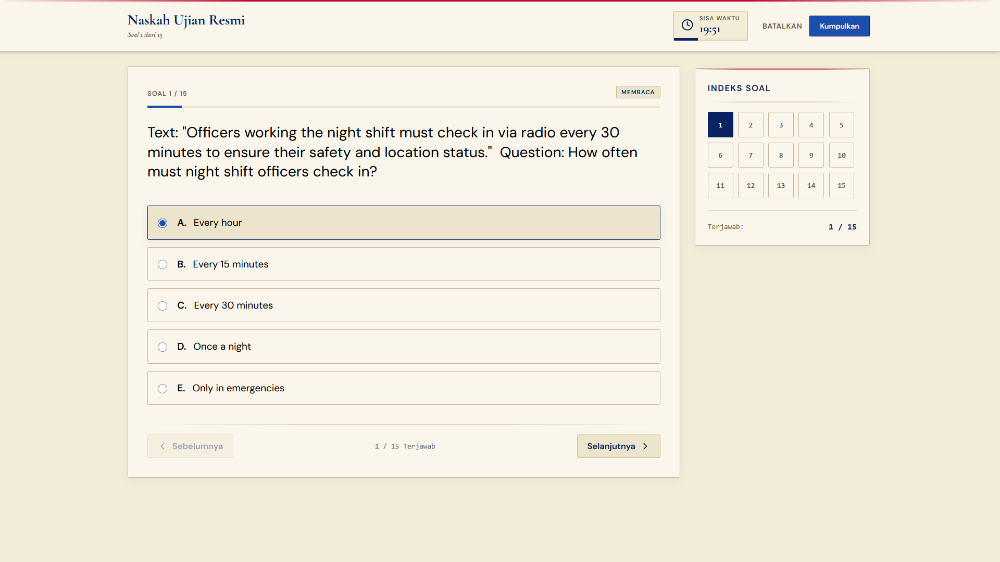
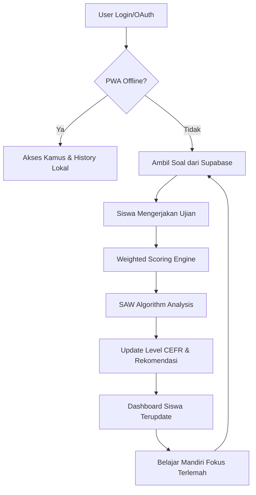

# Scholara - Advanced Exam & Learning Recommendation System



**Scholara** adalah platform simulasi ujian bahasa Inggris yang dirancang untuk mereplikasi pengalaman ujian nyata sekaligus memberikan rekomendasi belajar yang adaptif. Sistem ini memanfaatkan algoritma **SAW (Simple Additive Weighting)** untuk menganalisis performa ujian dan secara otomatis menentukan prioritas materi yang perlu dipelajari pengguna.

## Screenshots & Demo

> [!NOTE]
> Bagian ini disediakan untuk dokumentasi visual aplikasi.

| Desktop Dashboard                                | Mobile View                                        | Exam Interface                                   |
| :----------------------------------------------- | :------------------------------------------------- | :----------------------------------------------- |
|  |  |  |

### 🔗 Live Demo & Repository

- **Online Demo:** (https://scholara-beryl.vercel.app)
- **Repository:** (https://github.com/hnderwn/Scholara)

---

## 🚀 Fitur Unggulan

### 🎓 Untuk Siswa (Siswa)

- 🔐 **Authentication Multi-Method**: Login aman via Email atau **Google OAuth**.
- 📊 **Intelligent Dashboard**: Pantau skor CEFR, statistik progres, dan riwayat ujian.
- 📱 **Premium Mobile Experience**: Navigasi bawah (Bottom Nav) yang intuitif dan responsif.
- 🎯 **SAW Recommendations**: Algoritma cerdas yang menganalisis area terlemah untuk prioritas belajar.
- 🛡️ **Exam Protection & Safe Navigation**: Mencegah penutupan tab secara tidak sengaja dan memblokir tombol kembali browser saat ujian sedang berlangsung melalui dialog konfirmasi kustom (`ConfirmModal`).
- 🔒 **Diagnostic First Lock**: Mewajibkan siswa menyelesaikan Ujian Diagnostik terlebih dahulu sebelum dapat mengakses latihan materi lainnya.
- 📖 **Offline Dictionary**: Kamus bahasa Inggris lengkap yang tetap bisa diakses tanpa internet.
- 💾 **PWA Support**: Install aplikasi di HP/Desktop dan akses materi secara offline.

### ⚡ Fitur Teknis & Algoritma

- 🧮 **Simple Additive Weighting (SAW)**: Perhitungan presisi untuk menentukan kategori mana yang paling membutuhkan perbaikan.
- 📈 **CEFR Mapping**: Penilaian standar internasional (A1-C2) secara otomatis berdasarkan performa ujian.
- 🔄 **Offline Sync**: Mengerjakan ujian saat offline? Data akan otomatis sinkron ke Supabase saat koneksi kembali.
- 📦 **IndexedDB Storage**: Penyimpanan lokal yang kuat untuk data ujian dan kamus ribuan kata.
- 🧪 **Core Logic Testing**: Validasi logika algoritma SAW dan pemetaan CEFR menggunakan unit test otomatis (`vitest`).

### 🛠️ Untuk Admin

- 🎛️ **Smart Question Management**: Kelola soal dengan tingkat kesulitan dan bobot poin yang dinamis.
- 🛠️ **Debug Mode Control**: Mengaktifkan/menonaktifkan tombol bantuan debug (benar/salah/acak) untuk pengguna tertentu secara dinamis melalui dashboard manajemen pengguna (Users).
- 📈 **Advanced Analytics**: Grafik performa siswa dan log aktivitas sistem yang komprehensif.

---

## 🔄 Alur Kerja Aplikasi (Application Flow)

1. **Onboarding**: User mendaftar/masuk dan otomatis profil dibuat di database Supabase via Database Trigger.
2. **Simulasi Ujian**: Siswa mengerjakan paket soal (Diagnostic/Practice). Setiap jawaban benar dihitung berdasarkan **Bobot Poin**.
3. **Analisis SAW**: Setelah ujian, sistem memproses skor per kategori menggunakan algoritma SAW:
   - Menghitung _Cost_ (jarak ke skor sempurna).
   - Menerapkan _Weight_ (kepentingan kategori).
   - Menghitung _Foundation Multiplier_ (jika banyak salah di level dasar).
4. **Rekomendasi**: Dashboard menampilkan kategori prioritas (Kritis, Tinggi, Sedang, Rendah) beserta saran materi belajar.
5. **Iterasi**: Siswa belajar menggunakan materi rekomendasi dan mengulang ujian untuk melihat progres kenaikan level CEFR.



---

- 👥 **Student & Audit Logs**: Monitor pendaftaran pengguna dan setiap perubahan sistem secara transparan.

---

## 🛠️ Technology Stack

- **Core**: [React 18](https://reactjs.org/) + [Vite](https://vitejs.dev/)
- **Backend/Auth**: [Supabase](https://supabase.com/) (PostgreSQL + Realtime)
- **State/Caching**: React Context API + [IndexedDB](https://developer.mozilla.org/en-US/docs/Web/API/IndexedDB_API)
- **Styling**: [Tailwind CSS](https://tailwindcss.com/) (Scholara Design System)
- **PWA**: [Vite PWA Plugin](https://vite-pwa-org.netlify.app/)
- **Icons**: [Lucide React](https://lucide.dev/)

---

## 🏗️ Struktur Proyek

```
src/
├── components/          # Komponen UI Reusable (Layout, Exam, Common)
├── context/            # Management state global (Auth, Theme)
├── hooks/              # Custom hooks untuk logika spesifik
├── lib/                # Konfigurasi library (Supabase, SAW Engine)
├── pages/              # Halaman utama profil Siswa & Admin
├── utils/              # Helper functions & IndexedDB logic
└── App.jsx             # Root Routing & Layout Wrapper
```

---

## ⚙️ Instalasi & Setup

### 1. Persyaratan

- Node.js 18.x atau lebih tinggi
- Akun Supabase (Gratis)

### 2. Langkah Instalasi

```bash
# Clone repository
git clone <repository-url>
cd scholara-app

# Install dependencies
npm install

# Jalankan server development
npm run dev

# Jalankan unit testing (Vitest)
npm run test
```

### 3. Konfigurasi Environment (`.env`)

Buat file `.env` di root folder:

```env
VITE_SUPABASE_URL=https://your-project.supabase.co
VITE_SUPABASE_ANON_KEY=your-anon-key
```

---

## 📐 Logika Skor & SAW

Scholara menggunakan algoritma **SAW (Simple Additive Weighting)** yang telah dimodifikasi secara khusus. Alih-alih hanya memberikan skor akhir, algoritma ini dirancang untuk memberikan **rekomendasi cerdas** tentang materi apa yang harus paling diprioritaskan oleh siswa.

### Cara Kerja Algoritma:
1. **Pemberian Bobot (Weights)**: Setiap kategori materi bahasa Inggris memiliki beban kepentingannya masing-masing. Contoh: *Cloze* (Tes Rumpang) berbobot 30% karena melatih berbagai skill sekaligus, sedangkan *Vocab* (Kosakata) berbobot 20%.
2. **Kalkulasi Cost (Jarak Kelemahan)**: Sistem menghitung seberapa jauh siswa dari nilai sempurna untuk mencari kelemahan utamanya. Rumusnya: `(100 - Skor Asli) / 100`. Semakin kecil nilai ujian siswa, semakin tinggi "Cost" atau kebutuhannya untuk belajar.
3. **Multiplier Fondasi (Penggali Kesulitan Dasar)**: Ini adalah fitur analitik tercerdas aplikasi ini. Sistem mengintip tingkat kesulitan (*difficulty*) dari soal-soal yang salah dijawab. Jika siswa salah di soal tingkat dasar (Level 1), tingkat urgensi belajarnya akan **dikali lipat hingga 1.5x**.
4. **Rumus Final**: `Skor Prioritas = Cost × Bobot Kategori × Multiplier Fondasi`

### Contoh Kasus (User-Friendly Example):
Bayangkan Budi mendapat nilai **60 untuk Grammar** dan **60 untuk Reading**. Secara sekilas (di sistem ujian biasa), Budi terlihat sama-sama lemah di kedua materi tersebut.

Namun, mesin SAW Scholara menelusuri lebih dalam:
- Budi gagal *Reading* karena banyak salah di soal Level 3 (Level Sulit).
- Budi gagal *Grammar* karena dia banyak salah di soal Level 1 (Level Dasar).

**Hasil Rekomendasi**: Algoritma SAW akan secara otomatis melipatgandakan skor prioritas *Grammar* Budi karena terdeteksi bahwa dia kehilangan "fondasi dasar". Di Dashboard, sistem akan memberikan label **Kritis (Merah)** untuk *Grammar* dan menyuruh Budi untuk segera fokus memperbaikinya, sementara *Reading* hanya diberi label **Prioritas Sedang (Kuning)**.

---

## 📜 Lisensi & Kontribusi

Proyek ini dilisensikan di bawah **MIT License**. Kami sangat terbuka untuk kontribusi fitur baru atau perbaikan bug via Pull Request.

---

**✦ Scholara - Elevating English Proficiency Through Data ✦**
